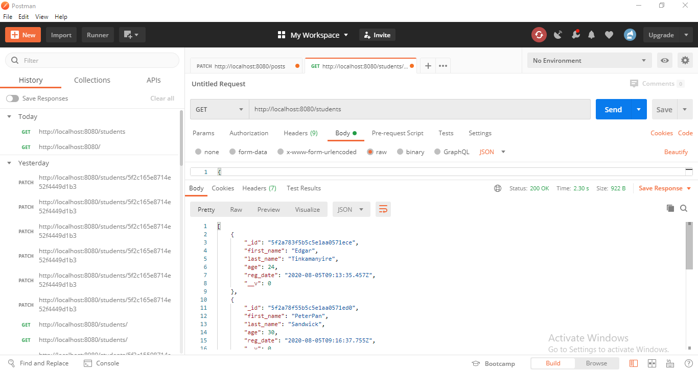
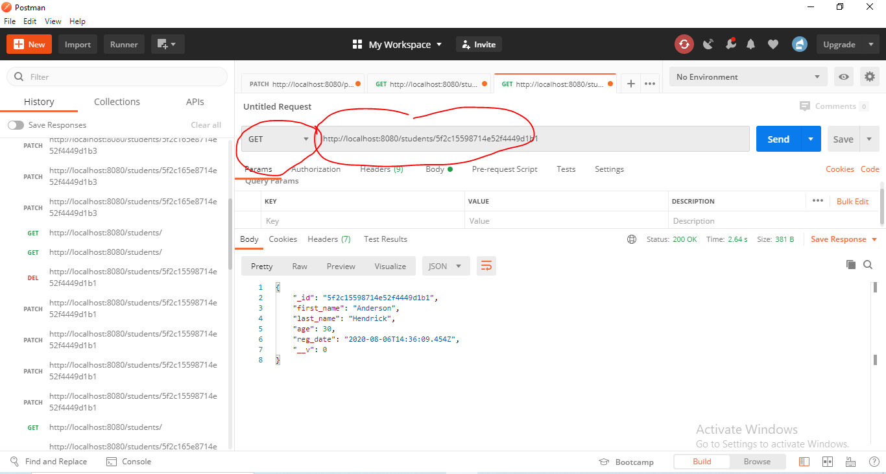
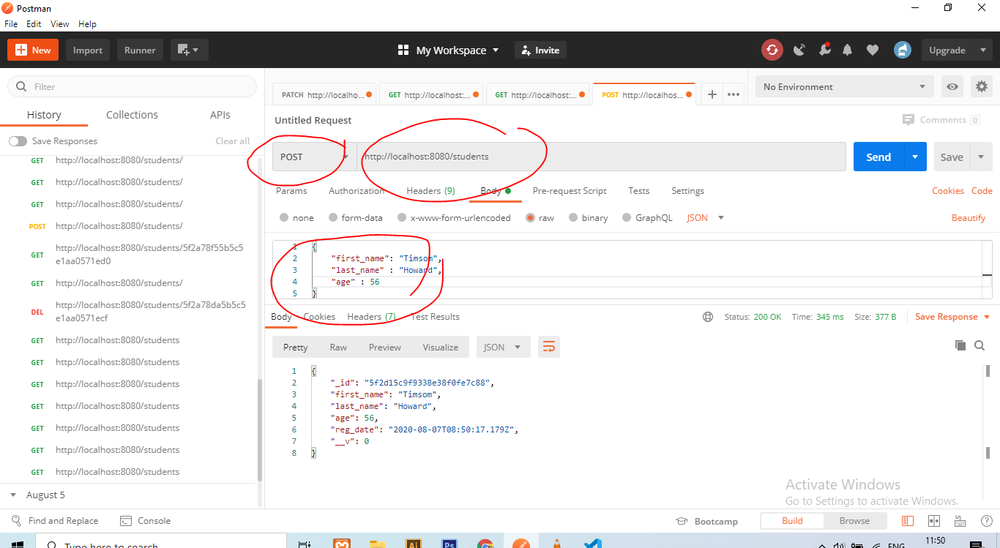

# Node js server with Mongodb

How to create a Nodejs server using mongodb creating endpoints for CRUD (Create, Read, Update and Delete) operations.

We shall test these endpoints with [Postman](https://www.postman.com/) to check if they are working perfectly fine.

---
## Requirements

For development, you will only need Node.js and a node global package, Yarn, installed in your environement.

### Node
- #### Node installation on Windows

  Just go on [official Node.js website](https://nodejs.org/) and download the installer.
Also, be sure to have `git` available in your PATH, `npm` might need it (You can find git [here](https://git-scm.com/)).

- #### Node installation on Ubuntu

  You can install nodejs and npm easily with apt install, just run the following commands.

      $ sudo apt install nodejs
      $ sudo apt install npm

- #### Other Operating Systems
  You can find more information about the installation on the [official Node.js website](https://nodejs.org/) and the [official NPM website](https://npmjs.org/).

If the installation was successful, you should be able to run the following command.

    $ node --version
    v8.11.3

    $ npm --version
    6.1.0

If you need to update `npm`, you can make it using `npm`! Cool right? After running the following command, just open again the command line and be happy.

    $ npm install npm -g

###

## Install

    $ git clone https://github.com/Edgar256/node-mongodb-server
    $ cd node-mongodb-server
    $ npm install

## Running the project

    $ npm start

## Testing the end points
The app is running on port 8080,  headover to Postman and enter this url

    http://localhost:8080/
    
You should be able to receive the messages in console.log to show that the app is running with no problems and is able to connect to our mongodb Database

    We are listen on port 8080
    connected to Db
    
### Retrieving list of all students, with the GET method
To retrieve all students in our DB , enter the url below to postman, select GET method from the drop down and send
    
    http://localhost:8080/students/
    

### Retrieving a particular student, with the GET method
To retrieve a specific in our DB , enter the url below to postman, select GET method from the drop down and send (this id is auto-assigned by our MongoDB)
    
    http://localhost:8080/students/{id}
    

### Adding a student to the DB, with the POST method

- To add DB , enter the url below to postman.

- Enter parameters for the first_name, last_name and age.

- Select POST method from the drop down and send. 
    
    http://localhost:8080/students/{id}
    

Cheers, Enjoy, our fully functional Restful API !!! 
